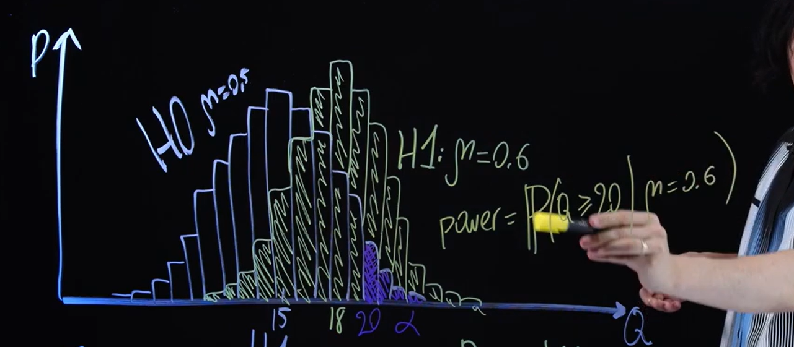

# Мощность

Условие:   
*Н0: $\mu=0.5$, Н1: $\mu>0.5$*  
*$\alpha = 0.05$*  
*Q - кол-во успешных доставок*  
*H1 верна: $\mu=0.6$*  
*S = [Q>=20]*  

*$Power = P(Q \geq 20| \mu = 0.6)$* - Мощность это вероятность отвергнуть H0 при том что верна H1.